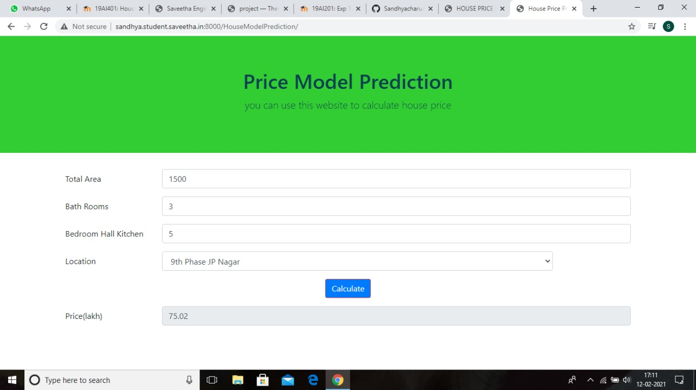
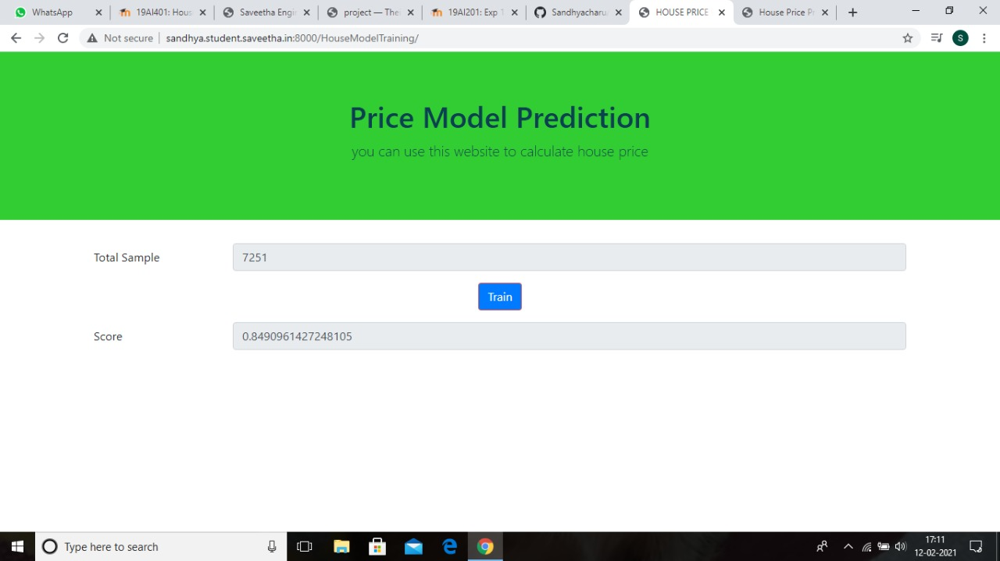
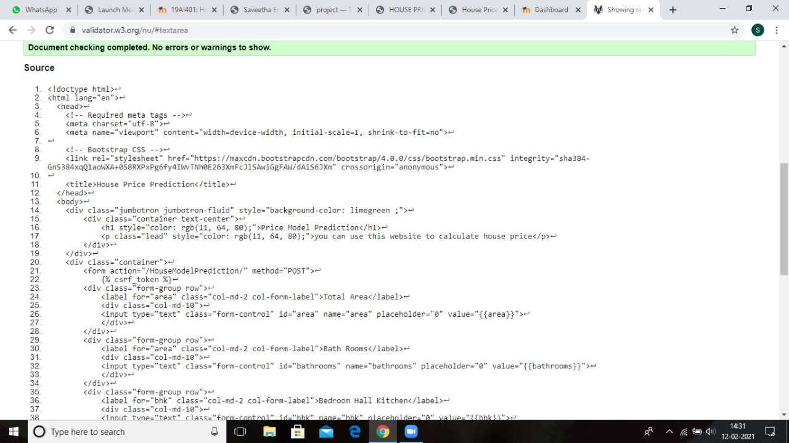

Readme
# House Price Prediction
## AIM:
To design a website to train the house price model and to predict the price.

## DESIGN STEPS:
### Step 1: 
Requirement collection.
### Step 2:
Creating the layout using HTML and CSS.
### Step 3:
Train the model using the given data set
### Step 4:
Save the trained model using pickle
### Step 5:
Get the input from the user
### Step 6:
Load the trained model using pickle
### Step 7:
Apply the given data to the model
### Step 8:
Display the result
### Step 9:
Publish the website in the given URL.

## PROGRAM:
### HouseModelPrediction.html
```

<!doctype html>
<html lang="en">
  <head>
    <!-- Required meta tags -->
    <meta charset="utf-8">
    <meta name="viewport" content="width=device-width, initial-scale=1, shrink-to-fit=no">

    <!-- Bootstrap CSS -->
    <link rel="stylesheet" href="https://maxcdn.bootstrapcdn.com/bootstrap/4.0.0/css/bootstrap.min.css" integrity="sha384-Gn5384xqQ1aoWXA+058RXPxPg6fy4IWvTNh0E263XmFcJlSAwiGgFAW/dAiS6JXm" crossorigin="anonymous">

    <title>House Price Prediction</title>
  </head>
  <body>
    <div class="jumbotron jumbotron-fluid" style="background-color: limegreen ;">
        <div class="container text-center">
            <h1 style="color: rgb(11, 64, 80);">Price Model Prediction</h1>
            <p class="lead" style="color: rgb(11, 64, 80);">you can use this website to calculate house price</p>
        </div>
    </div>
    <div class="container">
        <form action="/HouseModelPrediction/" method="POST">
            
        <div class="form-group row">
            <label for="area" class="col-md-2 col-form-label">Total Area</label>
            <div class="col-md-10">
            <input type="text" class="form-control" id="area" name="area" placeholder="0" value="{{area}}">
            </div>
        </div>
        <div class="form-group row">
            <label for="area" class="col-md-2 col-form-label">Bath Rooms</label>
            <div class="col-md-10">
            <input type="text" class="form-control" id="bathrooms" name="bathrooms" placeholder="0" value="{{bathrooms}}">
            </div>
        </div>
        <div class="form-group row">
            <label for="bhk" class="col-md-2 col-form-label">Bedroom Hall Kitchen</label>
            <div class="col-md-10">
            <input type="text" class="form-control" id="bhk" name="bhk" placeholder="0" value="{{bhk}}">
            </div>
        </div>
         <div class="form-group row">
            <label for="location" class="col-md-2 col-form-label">Location</label>
            <div class="col-md-10">
            <select id="location" name="location" class="col-md-10 form-control">
                 
                     
                    <option selected value="{{loc}}"> {{loc}} </option>
                     
                    <option value="{{loc}}">{{loc}}</option>
                    
             
             </select>
            </div>
        </div>
        <div class="form-group row text-center">
            <div class="col-md-12">
                <button type="submit" class="btn btn-primary" style="border-color: tomato;"> Calculate</button>
            </div>
        </div>
        <div class="form-group row">
            <label for="price" class="col-md-2 col-form-label">Price(lakh)</label>
            <div class="col-md-10">
            <input type="text" readonly class="form-control" id="price"  placeholder="-" value="{{price}}">
            </div>
        </div>
        </form>
    </div>

    <!-- Optional JavaScript -->
    <!-- jQuery first, then Popper.js, then Bootstrap JS -->
    <script src="https://code.jquery.com/jquery-3.2.1.slim.min.js" integrity="sha384-KJ3o2DKtIkvYIK3UENzmM7KCkRr/rE9/Qpg6aAZGJwFDMVNA/GpGFF93hXpG5KkN" crossorigin="anonymous"></script>
    <script src="https://cdnjs.cloudflare.com/ajax/libs/popper.js/1.12.9/umd/popper.min.js" integrity="sha384-ApNbgh9B+Y1QKtv3Rn7W3mgPxhU9K/ScQsAP7hUibX39j7fakFPskvXusvfa0b4Q" crossorigin="anonymous"></script>
    <script src="https://maxcdn.bootstrapcdn.com/bootstrap/4.0.0/js/bootstrap.min.js" integrity="sha384-JZR6Spejh4U02d8jOt6vLEHfe/JQGiRRSQQxSfFWpi1MquVdAyjUar5+76PVCmYl" crossorigin="anonymous"></script>
  </body>
</html>
```

### HouseModelTraining.html
```
<!doctype html>
<html lang="en">
  <head>
    <!-- Required meta tags -->
    <meta charset="utf-8">
    <meta name="viewport" content="width=device-width, initial-scale=1, shrink-to-fit=no">

    <!-- Bootstrap CSS -->
    <link rel="stylesheet" href="https://maxcdn.bootstrapcdn.com/bootstrap/4.0.0/css/bootstrap.min.css" integrity="sha384-Gn5384xqQ1aoWXA+058RXPxPg6fy4IWvTNh0E263XmFcJlSAwiGgFAW/dAiS6JXm" crossorigin="anonymous">

    <title>HOUSE PRICE PREDICTION</title>
  </head>
  <body>
    <div class="jumbotron jumbotron-fluid" style="background-color: limegreen ;">
        <div class="container text-center">
            <h1 style="color: rgb(11, 64, 80);">Price Model Prediction</h1>
            <p class="lead" style="color: rgb(11, 64, 80);">you can use this website to calculate house price</p>
        </div>
    </div>
    <div class="container">
        <form action="/HouseModelTraining/" method="POST">
        

        <div class="form-group row">
            <label for="samples" class="col-md-2 col-form-label">Total Sample</label>
            <div class="col-md-10">
            <input type="text" readonly class="form-control" id="samples" placeholder="." value="{{samples}}">
            </div>
        </div>
        <div class="form-group row text-center">
            <div class="col-md-12">
                <button type="submit" class="btn btn-primary" style="border-color: tomato;">  Train</button>
            </div>
        </div>
        <div class="form-group row">
            <label for="score" class="col-md-2 col-form-label">Score</label>
            <div class="col-md-10">
            <input type="text" readonly class="form-control" id="score" placeholder="." value="{{score}}">
            </div>
        </div>
        </form>
    </div>

    <!-- Optional JavaScript -->
    <!-- jQuery first, then Popper.js, then Bootstrap JS -->
    <script src="https://code.jquery.com/jquery-3.2.1.slim.min.js" integrity="sha384-KJ3o2DKtIkvYIK3UENzmM7KCkRr/rE9/Qpg6aAZGJwFDMVNA/GpGFF93hXpG5KkN" crossorigin="anonymous"></script>
    <script src="https://cdnjs.cloudflare.com/ajax/libs/popper.js/1.12.9/umd/popper.min.js" integrity="sha384-ApNbgh9B+Y1QKtv3Rn7W3mgPxhU9K/ScQsAP7hUibX39j7fakFPskvXusvfa0b4Q" crossorigin="anonymous"></script>
    <script src="https://maxcdn.bootstrapcdn.com/bootstrap/4.0.0/js/bootstrap.min.js" integrity="sha384-JZR6Spejh4U02d8jOt6vLEHfe/JQGiRRSQQxSfFWpi1MquVdAyjUar5+76PVCmYl" crossorigin="anonymous"></script>
  </body>
</html>
```
### views.py
```
from django.shortcuts import render
import numpy as np
import pandas as pd
from sklearn.model_selection import train_test_split
from sklearn import metrics
from sklearn.linear_model import LinearRegression
import pickle

# Create your views here.

def HouseModelTraining(request):
    context={}
    data = pd.read_csv("House_data_preprocessed.csv")
    context["samples"] = data.shape[0]

    if request.method == 'GET':
        context["score"] = "-"

    if request.method == 'POST':
        Y = data["price"]
        X = data.drop("price", axis="columns")
        X_train, X_test, y_train, y_test = train_test_split(X, Y, test_size=0.2)
        house_model = LinearRegression()
        house_model.fit(X_train, y_train)
        score = house_model.score(X_test, y_test)
        context["score"] = score
        with open('house_model.pickle','wb') as f:
            pickle.dump(house_model,f)
    return render(request, 'housepriceprediction/HouseModelTraining.html', context) 

def HouseModelPrediction(request):
    context={}
    data = pd.read_csv("House_data_preprocessed.csv")
    context["locations"] = data.columns[4:]
    
    if request.method == 'GET':
        context['area'] = '0'
        context['bathrooms'] = '0'
        context['bhk'] = "0"
        context['location'] = ''
        context['price'] = '-'

    if request.method == 'POST':
        area = int(request.POST.get('area',0))
        bathrooms = int(request.POST.get('bathrooms',0))
        bhk = int(request.POST.get('bhk',0))
        location = request.POST.get('location','-')

        context['area'] = area
        context['bathrooms'] = bathrooms
        context['bhk'] = bhk
        context['location'] = location

        Y = data["price"]
        X = data.drop("price", axis="columns")

        with open('house_model.pickle','rb') as f:
            house_model = pickle.load(f)

        loc_index = np.where(X.columns==location)[0][0]

        input = np.zeros(len(X.columns))
        input[0] = area
        input[1] = bathrooms
        input[2] = bhk
        if loc_index >= 0:
            input[loc_index] = 1

        price = house_model.predict([input])

        context['price'] = "{0:.2f}".format(price[0])

    return render(request, 'housepriceprediction/HouseModelPrediction.html', context)     
```

## OUTPUT:





## CODE VALIDATION REPORT:



## RESULT:
Thus a website is designed for predicting the house price and is hosted in the URL http://sandhya.student.saveetha.in:8000/ . HTML code is validated.


